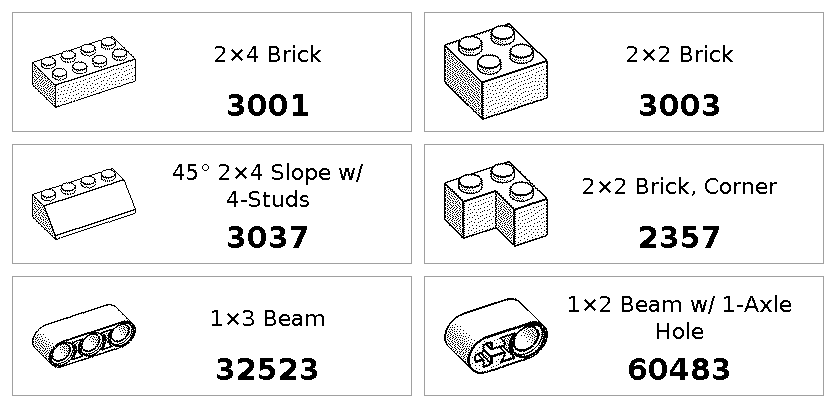
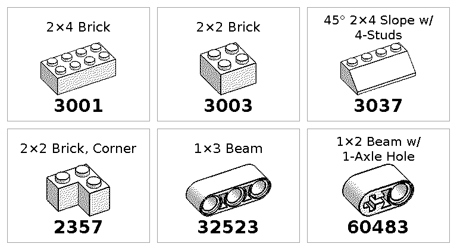
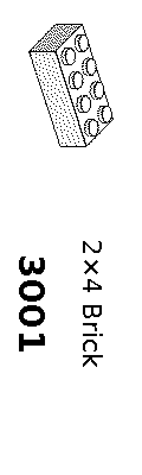
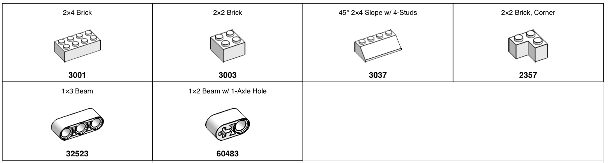

# Brick Labels

A command-line tool (`lego-labels`) that generates printable labels for LEGO piece organization: part image, part name and part number. It makes A4 PDF sheets, or print-ready labels for the Niimbot D101 thermal label printer, which it can also print directly over USB.

## Examples

Labels for six common parts, generated from [`examples/parts.txt`](examples/parts.txt). All files are in [`examples/`](examples/).

**Niimbot D101, 15x50 mm roll** (`--label-size 15x50`): 1-bit, dithered part image, 120x400 px at 203 dpi.



**Niimbot D101, 25x30 mm roll** (`--label-size 25x30`): shorter labels stack name, image and part number.





**Print-ready file** (right, shown at 2x): what is sent to the printer, rotated 90 degrees so the rows run along the paper feed. The previews above show the labels in reading orientation.

```bash
lego-labels --file examples/parts.txt --printer niimbot-d101 --label-size 15x50 --out examples/d101-15x50 --sheet
```

<br clear="right">

**A4 PDF sheet** (default output, [`examples/labels.pdf`](examples/labels.pdf)): 46x24 mm labels in a 4x12 grid with a cutting grid.



```bash
lego-labels --file examples/parts.txt --output examples/labels.pdf
```

Part images in the examples come from [BrickArchitect](https://brickarchitect.com), see [Credits](#credits).

## Features

- Fetch LEGO part information from BrickArchitect
- Download high-quality part images
- Generate professional PDF labels ready to print
- Multiple input methods (CLI args, file, interactive)
- Caching system to avoid redundant downloads
- Configurable label sizes
- Preview mode to view generated PDFs immediately
- Print-ready 1-bit PNG labels for the Niimbot D101 thermal printer, with optional direct printing

## Installation

### From source

```bash
git clone https://github.com/ayhid/brick-labels.git
cd brick-labels
pip install -e .
```

### Using pip (once published)

```bash
pip install lego-labels
```

## Quick Start

```bash
# Generate labels for specific parts
lego-labels 3037 3003 3001

# Read part numbers from a file
lego-labels --file parts.txt

# Interactive mode
lego-labels --interactive

# Generate with preview
lego-labels 3037 3003 --preview

# Custom output filename
lego-labels 3037 --output my-labels.pdf

# Verbose mode for detailed progress
lego-labels 3037 3003 3001 --verbose
```

## Usage

### Command Line Arguments

```bash
lego-labels [OPTIONS] [REFERENCES]...
```

#### Options

- `--file, -f PATH`: Read part references from file (one per line)
- `--interactive, -i`: Interactive mode - enter part references one by one
- `--output, -o FILE`: Output PDF file (default: labels.pdf)
- `--width FLOAT`: Label width in mm (default: 70)
- `--height FLOAT`: Label height in mm (default: 70)
- `--preview, -p`: Open PDF automatically after generation
- `--printer niimbot-d101`: Output print-ready PNGs for the Niimbot D101 (see [Niimbot D101](#niimbot-d101-thermal-label-printer))
- `--verbose, -v`: Show detailed progress information
- `--help`: Show help message

### File Format

Create a text file with one part reference per line:

```
3037
3003
3001
# Comments are ignored
3004
```

Then run:

```bash
lego-labels --file parts.txt
```

### Custom Label Sizes

Note: Custom sizes will override the default compact 24mm × 46mm format and may not align with the cutting grid.

```bash
# Custom 30mm x 50mm labels
lego-labels 3037 --width 50 --height 30
```

## Label Design

Each label contains:
1. **Part name/title** (top section, compact font)
2. **Part image** (centered, scaled to fit)
3. **Reference number** (bottom section, bold)

Compact label size (24mm × 46mm) optimized for storage bins and drawers, arranged in a 4×12 grid on A4 paper with cutting guides.

### Label Specifications

- **Page size**: A4 (210mm × 297mm)
- **Default label size**: 24mm × 46mm (height × width)
- **Grid layout**: 4 columns × 12 rows = 48 labels per page
- **Margins**: 5mm all sides
- **Cutting grid**: Light gray grid lines for easy cutting
- **Colors**: White background with black text
- **Border**: Thin black border around each label

## Examples

### Basic Usage

```bash
# Single part
lego-labels 3037

# Multiple parts
lego-labels 3037 3003 3001

# With preview
lego-labels 3037 3003 --preview
```

### From File

Create `my-parts.txt`:
```
3037
3003
3001
```

Run:
```bash
lego-labels --file my-parts.txt --output my-labels.pdf
```

### Interactive Mode

```bash
lego-labels --interactive
> 3037
> 3003
> 3001
>
✓ Generated 3 label(s) in labels.pdf
```

### Verbose Output

```bash
lego-labels 3037 3003 --verbose
```

Output:
```
Processing 2 part(s)...
  Fetching info for part 3037...
  Found: Plate 2 x 6
  Downloading image for part 3037...
  Image cached: /Users/you/.cache/lego-labels/3037.png
  Fetching info for part 3003...
  Found: Brick 2 x 2
  Using cached image for 3003
  Generating PDF with 2 label(s)...
  Adding label for part 3037 (1/2)
  Adding label for part 3003 (2/2)
  PDF saved to: labels.pdf
✓ Generated 2 label(s) in labels.pdf
```

## Niimbot D101 (thermal label printer)

With `--printer niimbot-d101`, the tool writes one print-ready PNG per part instead of a PDF.

- **Resolution**: 203 dpi, 8 px/mm. Label sizes in px are mm x 8 (15x50 mm gives 120x400 px, 25x30 mm gives 192x240 px).
- **Print head**: 192 px wide, perpendicular to the paper feed. Images are exactly the label width (at most 192 px). The printer places narrower labels on the paper itself, as the NiimBlue app does, so they are not padded to 192 px.
- **Pure black and white (1 bit)**: the part image is converted to grayscale and dithered (Floyd-Steinberg) so shaded renders don't print as solid black. Text is thresholded, not dithered.
- **Margins**: 2.5 mm are left blank at both ends of the label and 1 mm along the long edges, so nothing touches the die-cut edges.
- **Orientation**: the label is designed in landscape (length x width) for readability, then rotated 90 degrees clockwise for the printer. Long labels (length at least 1.6 times the width, e.g. 25x50) put the image on the left and the text on the right. Shorter ones stack name, image and reference like the PDF labels.

### Options

- `--printer niimbot-d101`: enable the D101 profile (PNG output). Without it, the PDF behavior is unchanged.
- `--label-size WxL|auto`: label width x length in mm (default: `25x30`). Width 12 to 25 mm, length 10 to 100 mm. `auto` reads the size from the roll loaded in the printer (see [Detecting the loaded roll](#detecting-the-loaded-roll)).
- `--out DIR`: output directory (default: `labels-d101`). Files are named `<index>-<reference>.png`, e.g. `001-3037.png`.
- `--sheet`: also write `DIR/sheet.png`, a contact sheet of all labels for preview.
- `--print`: send the labels to the printer after generating them (see below).
- `--port PORT`: USB serial port of the printer (default: auto-detect, picks the D101's USB serial device and ignores built-in ports).
- `--bt-address MAC`: print over Bluetooth instead of USB (Linux only).
- `--density N`: print density from 1 (light) to 3 (dark) (default: 3). The D101 has 3 levels.

`--label-size`, `--out`, `--sheet`, `--print`, `--port`, `--bt-address` and `--density` require `--printer`. `--output`, `--width`, `--height` and `--preview` are ignored with `--printer`.

### Example

```bash
lego-labels --file list.txt --printer niimbot-d101 --label-size 25x30 --out labels-d101 --sheet --verbose
```

This writes `labels-d101/001-11211.png`, `labels-d101/002-3700.png`, ... and `labels-d101/sheet.png`. You can print the PNGs with the Niimbot app or [NiimBlue](https://niim.blue), or directly with `--print`.

### Printing directly (`--print`)

Direct printing uses the open-source [niimprint](https://github.com/AndBondStyle/niimprint) library (MIT). It is optional and isolated in `lego_labels/niimbot.py`, so everything else works without it or without a printer attached. niimprint is not on PyPI and declares Python 3.11 only, so install it from git without its pinned dependencies (it only needs `pyserial` and Pillow, which are installed by the `print` extra and the base package):

```bash
pip install -e '.[print]'
pip install --no-deps --ignore-requires-python git+https://github.com/AndBondStyle/niimprint
```

Then:

```bash
# USB (port auto-detected, or pass e.g. --port /dev/cu.usbmodem00000000050C1)
lego-labels --file list.txt --printer niimbot-d101 --label-size auto --print

# Bluetooth (Linux only)
lego-labels --file list.txt --printer niimbot-d101 --print --bt-address 12:34:56:78:9A:BC
```

niimprint has no D101 model, and its own print function uses the older D11 command sequence, which the D101 does not answer. So `lego_labels/niimbot.py` uses niimprint only for the connection, the packet framing and the RFID read. It sends the D101 print sequence itself, following [niimbluelib](https://github.com/MultiMote/niimbluelib) (its "B1" print task): density, label type, print start, then for each label page start, page size, image rows and page end, then status polling and print end. All labels of a run are printed as one print job. Image packets are paced 10 ms apart, because the printer drops rows sent faster.

Python's Bluetooth sockets (`AF_BLUETOOTH`) are not available on macOS or Windows, so use USB there. If you print more labels than are left on the roll, you get a warning.

#### Troubleshooting printing

- **"No reply from the printer"**: the printer only answers one connection at a time. Close the Niimbot app or NiimBlue (phone or browser) or turn Bluetooth off on the phone. If a print was interrupted, the printer can stay stuck waiting: switch it off, unplug the USB cable for about 10 seconds, plug it back in and switch it on.
- **"Several USB serial ports found"**: pass the printer's port with `--port`, e.g. `--port /dev/cu.usbmodem00000000050C1` (list them with `ls /dev/cu.usbmodem*`).
- **Test first**: print a single label before a batch, e.g. `lego-labels 3001 --printer niimbot-d101 --label-size auto --out test --print`.

### Detecting the loaded roll

The printer does not report label dimensions. Genuine Niimbot rolls have an RFID tag with a product barcode, the number of labels and how many are used. `--label-size auto` reads that barcode and looks it up in `D101_ROLLS` in `lego_labels/config.py`:

```python
D101_ROLLS = {
    "6972842743596": (15, 50),  # T 15x50 white
}
```

```bash
lego-labels --file list.txt --printer niimbot-d101 --label-size auto --out labels-d101 --sheet
# Detected label roll 6972842743596: 15x50 mm, 142 label(s) left
```

For a roll that isn't in the table, the command stops and shows its barcode. Add the barcode to `D101_ROLLS` with the size printed on the box (width x length in mm), then run the command again. `--label-size auto` needs the printer connected and niimprint installed, but it only prints when you also pass `--print`.

## Cache

Downloaded images are cached in `~/.cache/lego-labels/` to avoid redundant downloads. The tool automatically uses cached images when available.

## Error Handling

The tool handles various errors gracefully:

- **Part not found (404)**: Skips with warning
- **Network errors**: Retries once, then skips
- **Missing images**: Shows placeholder text in label
- **Invalid input**: Clear error messages

## Requirements

- Python 3.8 or higher
- Internet connection for fetching part data
- Dependencies listed in `requirements.txt`

## Development

### Setup Development Environment

```bash
git clone https://github.com/ayhid/brick-labels.git
cd brick-labels
pip install -e '.[dev]'
```

### Run Tests

```bash
pytest tests/
```

### Project Structure

```
brick-labels/
├── lego_labels/
│   ├── __init__.py       # Package initialization
│   ├── cli.py            # CLI interface
│   ├── config.py         # Configuration and constants
│   ├── fetcher.py        # Web scraping logic
│   ├── generator.py      # PDF generation
│   ├── raster.py         # 1-bit PNG labels (Niimbot D101)
│   └── niimbot.py        # Optional direct printing on the D101
├── examples/             # Example outputs shown in this README
├── tests/
│   ├── test_fetcher.py   # Fetcher tests
│   ├── test_generator.py # Generator tests
│   ├── test_raster.py    # D101 PNG tests
│   ├── test_niimbot.py   # Printer protocol tests
│   └── test_cli.py       # CLI option tests
├── setup.py              # Package configuration
├── requirements.txt      # Dependencies
└── README.md            # This file
```

## Contributing

Contributions are welcome! Please feel free to submit a Pull Request.

## License

MIT License, see [LICENSE](LICENSE). The third-party projects below keep their own licenses.

## Credits

This project stands on the work of others. Thank you to all of them.

### Data

- **[BrickArchitect](https://brickarchitect.com)** by Tom Alphin: part names and part images are fetched from its LEGO parts guide at run time and cached locally. The tool does not ship any of them. The example labels in [`examples/`](examples/) contain six of these images, converted to 1-bit, to show the output. They remain the property of their owner and will be removed on request.

### Niimbot printing

- **[niimprint](https://github.com/AndBondStyle/niimprint)** by kjy00302 and AndBondStyle (MIT): USB serial and Bluetooth transports, packet framing and the RFID roll query.
- **[niimbluelib](https://github.com/MultiMote/niimbluelib)** by MultiMote (MIT): the reference for the D101 print sequence ("B1" print task), image row encoding, printer model data (192 px head, density 1 to 3, print direction) and packet pacing. `lego_labels/niimbot.py` reimplements that sequence in Python. No code is copied.
- **[NiimBlue](https://niim.blue)** by MultiMote: the web app built on niimbluelib, used as the reference for how narrow labels are sent.

### Python libraries

| Library | Used for | License |
|---|---|---|
| [ReportLab](https://www.reportlab.com/) | PDF label sheets | BSD |
| [Pillow](https://python-pillow.org/) | Image processing, dithering, PNG output | MIT-CMU |
| [Click](https://click.palletsprojects.com/) | Command-line interface | BSD-3-Clause |
| [Requests](https://requests.readthedocs.io/) | HTTP requests to BrickArchitect | Apache-2.0 |
| [Beautiful Soup](https://www.crummy.com/software/BeautifulSoup/) (with [soupsieve](https://facelessuser.github.io/soupsieve/)) | HTML parsing | MIT |
| [pySerial](https://github.com/pyserial/pyserial) | USB serial connection to the printer (optional) | BSD |
| [pytest](https://pytest.org/) | Tests | MIT |

### Fonts

- **[Bitstream Vera](https://www.gnome.org/fonts/)** (Vera and Vera Bold), copyright Bitstream, Inc.: the label text on D101 labels. The font files are not included here; they are loaded from the copy bundled with ReportLab.

### Algorithms

- **Floyd-Steinberg dithering** (Robert W. Floyd and Louis Steinberg, 1976), via Pillow, to turn the grayscale part renders into 1-bit images.

## Trademarks

LEGO® is a trademark of the LEGO Group, which does not sponsor, authorize or endorse this project. Niimbot is a trademark of its respective owner. This is an independent, unofficial project with no affiliation with BrickArchitect, the LEGO Group or Niimbot.

## Troubleshooting

### PDF won't open automatically with --preview

The tool uses platform-specific commands to open PDFs:
- macOS: `open`
- Windows: `start`
- Linux: `xdg-open`

If preview fails, you can manually open the generated PDF file.

### Part not found

If a part reference returns a 404 error, verify:
1. The part number is correct
2. The part exists on BrickArchitect
3. You have an internet connection

### Image not loading

Some parts may not have images available. The tool will show "[No Image]" in the label for these parts.

## Future Enhancements

- QR code generation for parts
- Different label templates (Avery, Dymo)
- Batch processing from directories
- Configuration file support
- Color coding by part category
